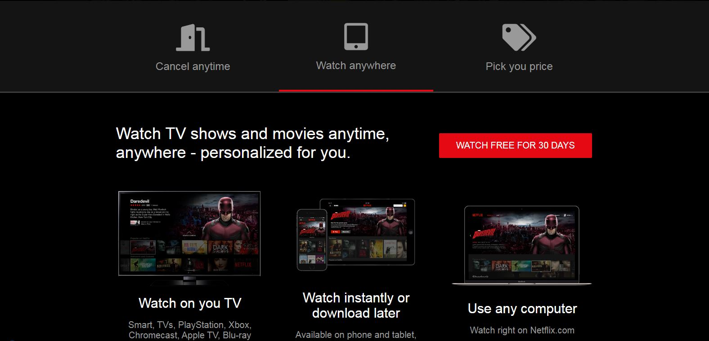
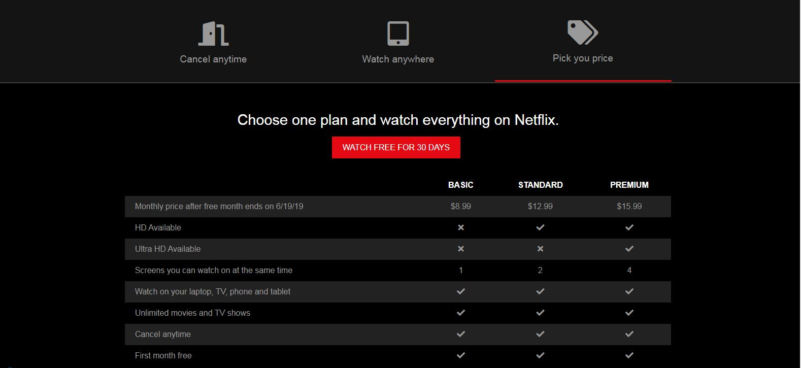

# Netflix-Landing-Page-Clone-with-HTML-CSS-JS
I have re-created the Netflix landing page using HTML, CSS and a bit of JavaScript for the tabs.Modern CSS3+ techniques are used like Grid, Flex, overlays, shadows, etc

Project is live at [Go to Netflix](https://swaminathan-0706.github.io/Netflix-Landing-Page-Clone-with-HTML-CSS-JS/)

